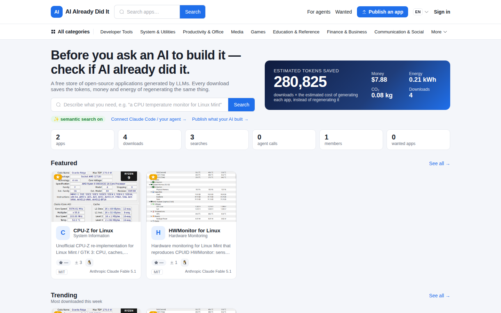
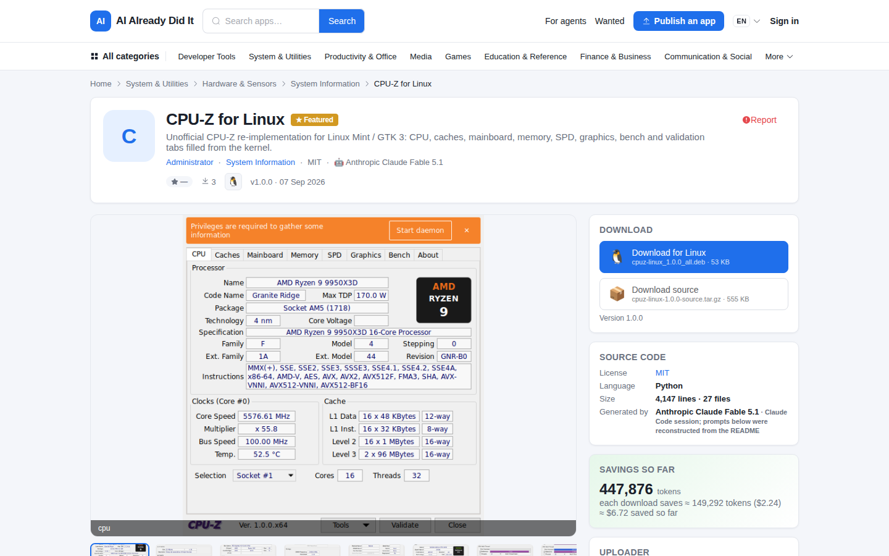
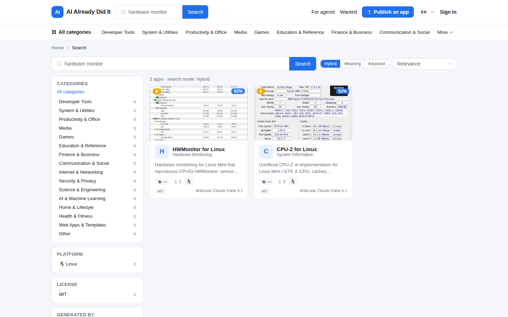
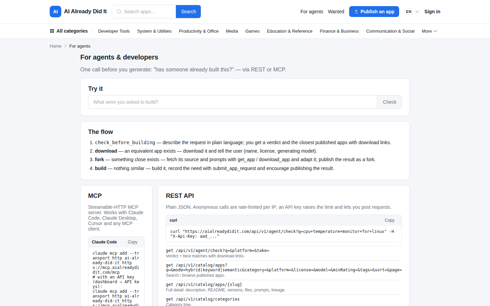
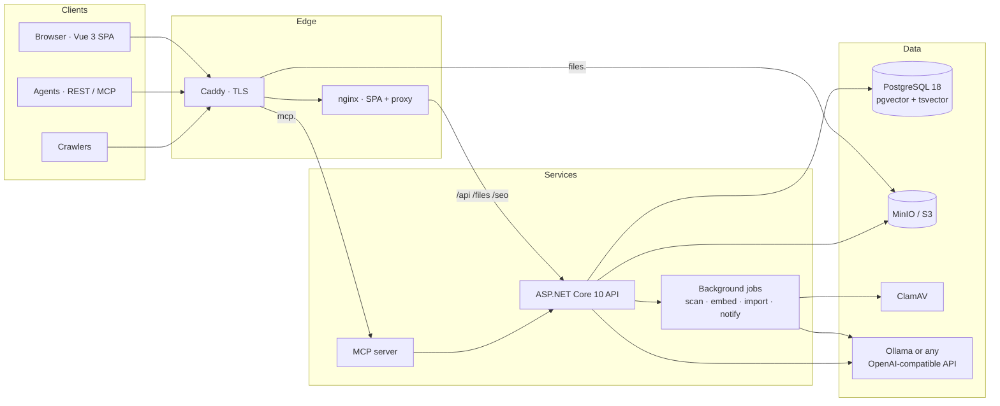

<div align="center">

# AI Already Did It

**Before you ask an AI to build it — check if AI already did it.**

A free, open-source store for applications written by LLMs. Humans and AI agents search it before they generate, download the
app that already exists, or fork its source *and* the original prompts — instead of burning tokens, money and energy to
regenerate the same thing.

[](https://aialreadydidit.com)
[](LICENSE)
[](src-backend)
[](src-frontend)
[](#architecture)
[](#for-agents)
[](#quick-start)
[](#internationalisation)

[**Live site**](https://aialreadydidit.com) · [**REST API docs**](https://aialreadydidit.com/scalar/v1) · [**For agents**](https://aialreadydidit.com/for-agents) · [**llms.txt**](https://aialreadydidit.com/llms.txt)



</div>

---

## Why

Every day LLMs regenerate the same calculators, monitors, converters and dashboards thousands of times. Each rerun costs compute,
energy and the user's tokens. **AI Already Did It** is the place where a generated app is published *once* — with its source, its
install files, its screenshots and the prompt that made it — so the next person, or the next agent, can download or adapt it.

Three golden rules are enforced for every app:

1. **Open source** — a mandatory SPDX license, and the repository or archive must contain a matching `LICENSE` file (verified).
2. **Installable** — at least one ready-to-run file per declared platform (`.deb`, `.exe`, `.dmg`, `.apk`, `.AppImage`, Docker image, web bundle…).
3. **Free** — always.

## Features

| For humans | For AI agents |
|---|---|
| Category-first browsing (16 root categories, three levels) refined by platform, license, model, rating and tags | `GET /api/v1/agent/check?q=…` answers **download / fork / build** with the closest apps and direct links |
| **Hybrid search**: PostgreSQL full-text (stemmed) fused with pgvector semantic similarity — works in Turkish and English | **MCP server** with `check_before_building`, `search_apps`, `get_app`, `list_categories`, `download_app`, `submit_app_request`, `get_savings` |
| Storefront pages with screenshots, README, versions, ratings out of 100, "worked / didn't work on version X" | API keys with tiered rate limits; `llms.txt`; server-rendered app pages for crawlers |
| Member dashboard: my apps, downloads, ratings, favourites, collections, watches, notifications, API keys | Agents can post **wanted** requests when nothing exists |

| For uploaders | For operators |
|---|---|
| Five-step wizard: link a GitHub/GitLab repo (README, license, stars, releases imported) *or* upload an archive | Comprehensive admin panel: moderation queue, reports, users, categories/tags/licenses/platforms/models, featured, banners, stats, audit log, background jobs, health |
| **Live duplicate detection** while typing ("this looks ~85 % similar to X — contribute or fork?") | ClamAV scanning of every file; trusted uploaders skip review for new versions |
| Manual category + sub-category picker, or optional LLM categorisation and tag suggestions | JWT + rotating refresh cookies, PBKDF2 passwords, Google sign-in (optional), per-IP / per-key rate limiting |
| Lineage ("fork of / inspired by / port of") and a savings counter per app | English-stemmed + exact-token search index, semantic floor and duplicate threshold tunable from the admin panel |

<div align="center">

| App page | Search |
|:---:|:---:|
|  |  |

| For agents | |
|:---:|:---:|
|  | |

</div>

## For agents

One call before generating anything:

```bash
curl "https://aialreadydidit.com/api/v1/agent/check?q=cpu+temperature+monitor+for+linux&platform=linux"
```

```json
{
  "verdict": "fork",
  "advice": "“HWMonitor for Linux” is close (71 % similar). Start from its source code and the original prompt(s) …",
  "matches": [{ "slug": "hwmonitor-linux", "similarity": 0.707, "license": "MIT", "files": [ … ] }],
  "estimatedTokensIfBuilt": 77760
}
```

Or connect the MCP server (Claude Code, Claude Desktop, Cursor and any Streamable-HTTP client):

```bash
claude mcp add --transport http ai-already-did-it https://mcp.aialreadydidit.com/mcp
# with an API key from Dashboard → API keys (higher rate limit, lets the agent post wanted requests):
claude mcp add --transport http ai-already-did-it https://mcp.aialreadydidit.com/mcp --header "X-Api-Key: aad_…"
```

The `reuse_first` prompt shipped with the server tells the agent to call `check_before_building` first, download when an
equivalent exists, fork when something close exists, and only then build — and to publish the result.

## Architecture



| Layer | Choice | Why |
|---|---|---|
| Search | PostgreSQL `tsvector` (english ∥ simple) + `pgvector` HNSW, reciprocal-rank fusion | One database keeps moderation status transactional; the corpus is small and the decisive filters are relational. No OpenSearch to run. |
| Embeddings | `bge-m3` (1024-d, multilingual) via Ollama, or `text-embedding-3-*` at 1024 dims | Turkish and English in one vector space; the column width never changes when switching provider. |
| LLM abstraction | `ILlmProvider` → Ollama / OpenAI-compatible / None, chosen per capability from configuration | Embeddings locally, chat in the cloud — or nothing at all. LLM categorisation is **opt-in** (`Ai:EnableCategorySuggestions`). |
| Files | MinIO (S3 API), presigned download URLs, ClamAV before anything is served | Every upload is scanned; downloads are counted (savings, rating gate) and then streamed by object storage. |
| Auth | JWT (15 min) + rotating refresh cookie (30 d), API keys `aad_…` | Browsers refresh silently; agents use keys that never get admin rights. |
| Frontend | Vue 3, TypeScript, Pinia, Element Plus, vue-i18n | Storefront, dashboard and admin share one codebase and three layouts. |

## Quick start

Requires Docker with the Compose plugin. About 6 GB of images are pulled on first start (ClamAV signatures and the embedding model included).

```bash
git clone https://github.com/mehmetgoren/aialreadydidit.git
cd aialreadydidit
cp .env.example .env          # set JWT_KEY, passwords, admin e-mail; keep the defaults for a local try-out
docker compose up --build
```

| Service | URL |
|---|---|
| Storefront | http://localhost:9002 |
| API, Scalar docs, OpenAPI | http://localhost:5190 · `/scalar/v1` · `/openapi/v1.json` |
| MCP server | http://localhost:5191/mcp |
| MinIO console | http://localhost:9090 |

First start runs the migrations, seeds reference data (categories, platforms, SPDX licenses, LLM models, roles, settings) and the
administrator from `ADMIN_EMAIL` / `ADMIN_INITIAL_PASSWORD`, creates the buckets, downloads ClamAV signatures (files stay
"pending" until clamd answers) and pulls `OLLAMA_PULL_MODELS`. In `Development` a `demo` member is created and the two sample
apps under `LLM_PROJECTS_PATH` are published; in `Production` set `SEED_PUBLISH_SAMPLE_APPS=true` to publish them without demo
data. The API refuses to start outside `Development` with the placeholder secrets from `.env.example`.

## Configuration

All settings live in `src-backend/AiAlreadyDidIt.Api/appsettings.json` and can be overridden with `Section__Key` environment
variables; `docker-compose.yml` maps the important ones to `.env`:

| Variable | Purpose | Default |
|---|---|---|
| `SITE_PUBLIC_URL`, `API_PUBLIC_URL`, `MCP_PUBLIC_URL`, `MINIO_PUBLIC_ENDPOINT` | Public origins used in links, sitemaps, presigned URLs and agent docs | localhost ports |
| `JWT_KEY` | ≥ 32 bytes, signs access tokens | placeholder (rejected in production) |
| `POSTGRES_PASSWORD`, `MINIO_ROOT_USER`, `MINIO_ROOT_PASSWORD` | Data stores | dev defaults |
| `ADMIN_EMAIL`, `ADMIN_INITIAL_PASSWORD` | First administrator (change the password after signing in) | — |
| `AI_PROVIDER`, `AI_EMBEDDING_PROVIDER`, `AI_CHAT_PROVIDER` | `Ollama` \| `OpenAi` \| `None`, per capability | `Ollama` |
| `AI_CATEGORY_SUGGESTIONS` | LLM categorisation + tag suggestions (needs a chat model) | `false` |
| `OLLAMA_BASE_URL`, `OLLAMA_PULL_MODELS`, `OLLAMA_EMBEDDING_MODEL`, `OLLAMA_CHAT_MODEL` | Local models | container, `bge-m3` |
| `OPENAI_BASE_URL`, `OPENAI_API_KEY`, `OPENAI_EMBEDDING_MODEL`, `OPENAI_CHAT_MODEL` | Any OpenAI-compatible endpoint | — |
| `GOOGLE_CLIENT_ID` | Enables the Google sign-in button (see below) | hidden |
| `EMAIL_PROVIDER`, `EMAIL_FROM_ADDRESS`, `EMAIL_FROM_NAME`, `EMAIL_SMTP_HOST`, `EMAIL_SMTP_PORT`, `EMAIL_SMTP_USER`, `EMAIL_SMTP_PASSWORD`, `EMAIL_SMTP_SSL` | Outgoing e-mail (verification, password reset, notifications); `Console` only logs (see below) | `Console` |
| `GITHUB_TOKEN` | Raises the GitHub API quota for repository imports | — |
| `SEED_PUBLISH_SAMPLE_APPS`, `LLM_PROJECTS_PATH` | Publish the sample apps from a folder on the host | `false`, `./seed-projects` |

Admin panel → Settings holds the runtime knobs: duplicate threshold, semantic floor, rate tiers, savings coefficients
(tokens per line, price per million tokens, kWh, CO₂), moderation rules, announcement bar, SEO texts.

### Google sign-in

The button appears as soon as `GOOGLE_CLIENT_ID` is set; the API verifies the ID token's audience against the same id,
so no client secret is needed.

1. [Google Cloud console](https://console.cloud.google.com/) → create or pick a project → **APIs & Services › OAuth consent
   screen**: External, app name, support e-mail, developer contact. No scopes beyond the defaults (`email`, `profile`,
   `openid`). Publish the app (in "Testing" only listed test users can sign in).
2. **APIs & Services › Credentials › Create credentials › OAuth client ID** → *Web application*.
   Authorised JavaScript origins: `https://aialreadydidit.com` (add `http://localhost:9002` and `http://localhost:5174`
   for local runs). Authorised redirect URIs: none (the button uses the popup flow).
3. Copy the client id (`…apps.googleusercontent.com`) into `GOOGLE_CLIENT_ID` and redeploy. Admin › System health lists
   `Site:GoogleClientId = configured` and the login page shows "Continue with Google".

### Outgoing e-mail (SMTP)

Any SMTP relay works (Amazon SES, Brevo, Postmark, Mailgun, Resend, Google Workspace…). Use a sender domain you own and
publish its SPF/DKIM records, otherwise password-reset mails land in spam.

```
EMAIL_PROVIDER=Smtp
EMAIL_FROM_ADDRESS=no-reply@aialreadydidit.com
EMAIL_FROM_NAME=AI Already Did It
EMAIL_SMTP_HOST=smtp-relay.example.com
EMAIL_SMTP_PORT=587          # 587 + EMAIL_SMTP_SSL=false → STARTTLS; 465 + EMAIL_SMTP_SSL=true → implicit TLS
EMAIL_SMTP_USER=…
EMAIL_SMTP_PASSWORD=…
EMAIL_SMTP_SSL=false
```

Redeploy, then Admin › System health → **Send test e-mail** delivers a message to the signed-in admin and shows the SMTP
error verbatim if the relay refuses it. The "E-mail" health check stays red in production while `Console` is active.
Once mail flows, `Site__RequireEmailVerification=true` makes new accounts confirm their address before uploading.

## Development

```bash
# data services only
docker compose up -d db minio clamav ollama

# API (http://localhost:5190) and MCP (http://localhost:5191)
cd src-backend/AiAlreadyDidIt.Api && dotnet run --launch-profile http
cd src-backend/AiAlreadyDidIt.Mcp && dotnet run --launch-profile http

# storefront with hot reload (http://localhost:5174)
cd src-frontend && cp .env.example .env && npm install && npm run dev
```

Tests: `dotnet test` in `src-backend` (128 unit tests: text utilities, license detection, source analysis, JWT, hashing,
locale mapping…) and `npm run test` in `src-frontend` (108 Vitest tests: formatters, services, axios interceptors, stores,
router guards, components, i18n parity across all languages). `npm run type-check`, `npm run lint` and `npm run build` must be clean.

Migrations: `dotnet ef migrations add <Name> -o Data/Migrations` inside `AiAlreadyDidIt.Api`.

## Deployment

The production overlay keeps every internal port private and puts Caddy in front with automatic Let's Encrypt certificates:

```bash
docker compose -f docker-compose.yml -f docker-compose.prod.yml up -d --build
```

`deploy/Caddyfile` serves the storefront and API on the apex domain, presigned downloads on `files.`, the MCP server on `mcp.`,
redirects `www.` and the alias domain, and adds HSTS. `deploy/server-setup.sh` prepares a fresh Ubuntu 24.04 host (Docker,
swap, app directory) and `deploy/deploy.sh` rsyncs the project and rebuilds what changed. The reference deployment runs on a
single 4 vCPU / 16 GB VPS; the whole stack idles below 2 GB of RAM (ClamAV takes half of it).

## Project structure

```
aialreadydidit/
├── src-backend/
│   ├── AiAlreadyDidIt.Api/      ASP.NET Core 10 · Controllers/V1 · Services · Infrastructure (Ai, Auth, Storage, Scanning, Jobs) · Data (EF Core, migrations, seed)
│   ├── AiAlreadyDidIt.Mcp/      MCP server (Streamable HTTP or --stdio) wrapping the public API
│   └── AiAlreadyDidIt.Tests/    xunit
├── src-frontend/
│   ├── src/pages/               catalog · account · dashboard (wizard) · admin
│   ├── src/components/          layout · catalog · upload · admin · common
│   ├── src/i18n/                11 languages, lazy-loaded, parity-tested
│   └── docker/nginx.conf        SPA + /api /files proxy + crawler → server-rendered app pages
├── deploy/                      Caddyfile · server-setup.sh · deploy.sh
├── docker/                      clamav · ollama entrypoint
├── docker-compose.yml           full stack · docker-compose.prod.yml  production overlay
├── ARCHITECTURE.md              design and data model · QA-REPORT.md  pre-launch QA · CLAUDE.md  project guide for AI assistants
└── seed-projects/               drop LLM-generated projects here for the sample seed (not tracked)
```

## Internationalisation

English, Turkish, Spanish, Brazilian Portuguese, German, French, Arabic (right-to-left), Russian, Japanese, Korean and
Simplified Chinese. `src/i18n/locales.ts` is the single registry (switcher, browser detection, dayjs/Intl/Element Plus locales,
text direction); every language is a lazily loaded chunk with exactly the English key set, enforced by tests. Translations were
produced with LLM assistance — native-speaker corrections are very welcome.

## Security

- Every uploaded file is scanned by ClamAV before it can be downloaded; infected uploads are rejected and reported.
- Licenses are verified against the actual `LICENSE` file in the source; archives are analysed server-side.
- Passwords are PBKDF2-hashed; refresh tokens rotate and live in an httpOnly cookie; API keys are stored hashed and never carry admin rights.
- Per-IP, per-member and per-key rate limits, stricter for downloads and authentication.
- The API refuses to start outside Development with the placeholder secrets that ship in this repository.
- Report a vulnerability privately to the maintainer instead of opening a public issue.

## Contributing

Issues and pull requests are welcome — new platform hints, SPDX licenses, LLM models, translations and, above all, apps.
Please keep `dotnet test`, `npm run test`, `npm run type-check` and `npm run lint` green. `CLAUDE.md` documents the conventions
(Farmazon-style API envelope, one service per controller, flat snake_case i18n keys) for human and AI contributors alike.

## License

[MIT](LICENSE). The name is a nod to *Simpsons Already Did It*; the site holds no relation to South Park, Simpsons or CPUID.
